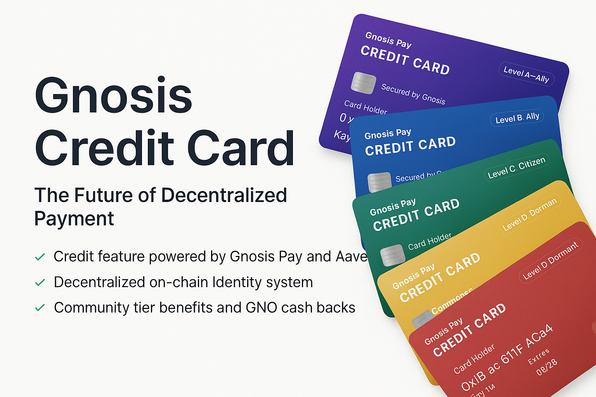
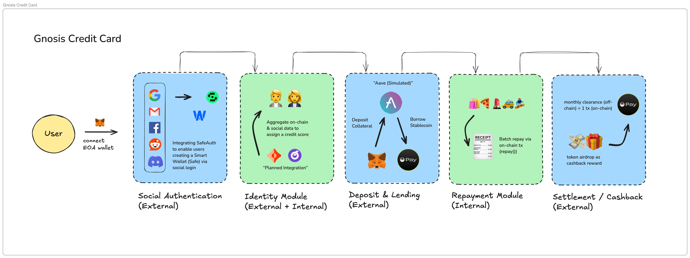

# Gnosis Credit Card



Gnosis Credit Card enables self-custodial spending with pre-approved credit, driven by decentralized identity and on-chain reputation.

With SafeAuth social login, Aave-backed borrowing, and off-chain settlement, users enjoy a seamless credit experience — without compromising ownership or privacy.

## 🔄 User Journey



- Sign In with Social Account

  - User logs in via SafeAuth and instantly creates a self-custodial Safe smart wallet.

- Get a Credit Score

  - A mock identity system assigns a credit tier based on on-chain activity and reputation.

- Deposit Collateral & Activate Credit

  - User deposits ETH, and the system borrows stablecoins using a mock Aave lending flow.

- Spend Off-Chain

  - Users spend within their credit limit; each transaction is recorded and hashed off-chain.

- Monthly Settlement

  - Users repay manually or via auto-deduction from collateral; zk-proofs are optional for privacy.

- Earn Rewards & Build Credit
  - After repayment, users receive token rewards and see their credit score adjust over time.

## 🚀 Key Features

### 1. Social Authentication

- Built with Safe and Web3Auth's new SafeAuth system
- Users can log in using social accounts (e.g., Google, Discord) without leaving the dApp
- Instantly creates a Safe Smart Account as the user's credit wallet

### 2. Identity & Credit Scoring

- Comprehensive DID (Decentralized Identity) integration (_simulated_)
- On-chain data analysis for credit assessment
- Gnosis Pay transaction history analysis
- Five-tier credit rating system:
  - Different credit limits
  - Variable cashback rewards
  - Customized interest rates

### 3. Deposit & Lending

- Aave V3 protocol integration (_simulated_)
- Direct collateral deposit / funds borrow through the credit card interface
- 50% Loan-to-Value (LTV) ratio
- Real-time collateral management

### 4. Repayment System

- Off-chain pre-payment system
- Merkle tree-based transaction hashing
- Credit limit-based spending authorization
- Real-time transaction tracking

### 5. Settlement & Rewards

- Monthly batch settlement of off-chain transactions
- Optional ZK proof-based settlement for privacy
- Automated cashback token distribution

## 🛠️ Technical Stack

- **Smart Contracts**: Solidity, Hardhat, Ethers.js, Viem -> Includes mock lending contracts inspired by Aave v3 (real Aave integration planned).
- **Frontend**: Next.js, TypeScript, React, Tailwind CSS, Radix UI
- **Authentication**: Safe Core SDK, Safe Protocol Kit, Safe API Kit, SafeAuth (Safe x Web3Auth), RainbowKit
- **Identity**: Mock credit scoring based on on-chain data (Ceramic-based DID integration planned)
- **Settlement**: Off-chain Merkle tree batching (ZK proof integration planned)
- **Blockchain**: Gnosis Chiado Testnet

## 🚀 Getting Started

### Prerequisites

- Node.js (v18 or higher)
- MetaMask wallet
- Git
- pnpm (recommended) or npm

### Installation

1. Clone the repository:

```bash
git clone https://github.com/your-username/gnosis-credit-card.git
cd gnosis-credit-card
```

2. Install dependencies:

```bash
pnpm install
```

3. Set up environment variables:

```bash
cp .env.example .env.local
```

Required environment variables:

```env
NEXT_PUBLIC_WEB3AUTH_CLIENT_ID=your_web3auth_client_id
NEXT_PUBLIC_INFURA_KEY=your_infura_key
NEXT_PUBLIC_CHIADO_RPC_URL=https://rpc.chiadochain.net
NEXT_PUBLIC_MOCK_WSTETH_ADDRESS=0x9fa52f7c3a19a066a9b7f2EBCA4BC6340366518F
NEXT_PUBLIC_MOCK_USDC_ADDRESS=0x969A2c1c858DA82FB48627DF8f5726c1fE0a2e94
NEXT_PUBLIC_MOCK_EURE_ADDRESS=0x137e7a3c32993cD0c15dfDF3020875322da145cd
NEXT_PUBLIC_MOCK_LENDING_PROTOCOL=0xF1D00F6c7E7Fc7Eda00fCe95583b8d6DD4716572
NEXT_PUBLIC_GNO_POINTS=0x70630625dCc6FDb9EFD00466A47E7d3883E6F5d5
NEXT_PUBLIC_GNOSIS_CREDIT_CARD=0x08069fE12cE51755984ae0D466ECc897f4A7984D
```

4. Start the development server:

```bash
pnpm dev
```

The application will be available at `http://localhost:3000`

### Smart Contract Deployment

1. Install Foundry:

```bash
curl -L https://foundry.paradigm.xyz | bash
foundryup
```

2. Deploy contracts to Chiado testnet:

```bash
cd contracts
forge build
forge script script/Deploy.s.sol:DeployScript --rpc-url $NEXT_PUBLIC_CHIADO_RPC_URL --broadcast
```

### Testing

Run the test suite:

```bash
# Unit tests
pnpm test

# E2E tests
pnpm test:e2e
```

### Building for Production

```bash
pnpm build
```

### Docker Support

Build and run with Docker:

```bash
docker build -t gnosis-credit-card .
docker run -p 3000:3000 gnosis-credit-card
```

## 🔒 Security Features

- Multi-signature wallet protection
- Social recovery mechanisms
- Privacy-preserving transaction options
- Secure credit limit management
- Automated risk assessment

## 📊 Credit Formula

A trust layer that scores users across 3 weighted dimensions (each 0–100):

| Dimension                 | Weight | Description                                        |
| ------------------------- | ------ | -------------------------------------------------- |
| Financial Trustworthiness | 40%    | DeFi activity, LTV, repayment, liquidation         |
| DAO Participation         | 30%    | Snapshot voting, GNO staking, proposal involvement |
| Social Connectivity       | 30%    | Multisig partners, Gitcoin Passport, social proof  |

- Total score = `0.4 × Financial + 0.3 × DAO + 0.3 × Social`
- Credit score influences borrowing limit and loan parameters

## 💰 Credit Tiers

| Credit Tier  | Credit Score | Credit Limit | Cashback Reward | Interest Rate (based on Aave rate) |
| ------------ | ------------ | ------------ | --------------- | ---------------------------------- |
| S, Sovereign | 800-1000     | $15,000      | 3%              | 0.8x                               |
| A, Ally      | 650-799      | $10,000      | 2%              | 1x                                 |
| B, Basic     | 500-649      | $5,000       | 1.5%            | 1.2x                               |
| C, Citizen   | 350-499      | $3,000       | 1%              | 1.5x                               |
| D, Dormant   | 0-349        | $1,000       | 0.5%            | 1.8x                               |

## 📈 Future Developments

### Phase 1: Make It Work

- Integrate with Aave v3 on Gnosis Chain for actual lending and borrowing.
- Integrate Gnosis Pay API for issuing payment credentials and settlement.
- Connect Ceramic for decentralized identity (DID) management.
- Merge Gnosis Pay DID data to improve credit scoring granularity.

### Phase 2: Make It Better

Allow users to generate ZK proofs of spending:

- Prove creditworthiness without revealing transaction details.
- Optional submission to 3rd-party credit evaluators or lending markets.

## 📄 License

This project is licensed under the MIT License - see the LICENSE file for details.
